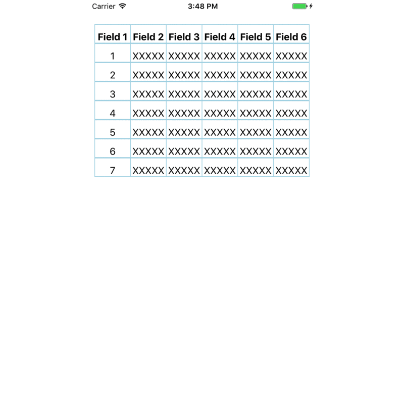
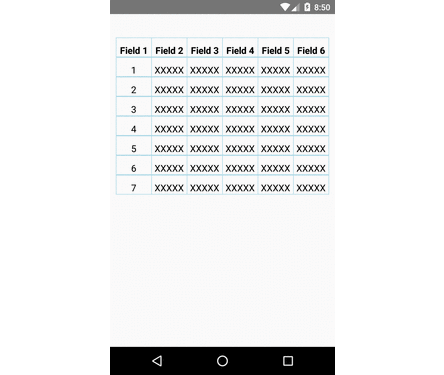

# react-native-data-grid

  

A component that performs simple CRUD operations.


To build the examples locally, run:

```
$ git clone https://github.com/ahmetMesut/react-native-data-grid.git
cd react-native-data-grid/Example && npm install
react-native run-ios or react-native run-android
```

Then open your emulator.


## Installation

```
npm install react-native-data-grid --save
```


## Usage

First of all you need to give JSON model for grid template.Then you have to give a url or a defaultGridData like Example.

```
import {DataGrid} from 'react-native-data-grid';

  <DataGrid fields={Model.fields} url="YOUR_URL_PUT_HERE"/>
  
  <DataGrid fields={Model.fields} defaultGridData={YOUR_DEFAULT_GRID_DATA}/>
```

### Properties

| Property | Type | Default | Description|
|---------------|------------|------------|----------------------------------------------------------------|
| ajaxConfig         | `object  ` |            |                                        |
| checkBox           | `bool`     | false           |                                        |
| checkedImage       | `element`  |            |                                        |
| unCheckedImage     | `element ` |            |                                        |
| checkSize          | `number`   |            |                                        |
| defaultGridData    | `array`    |            |                                        |
| fields             | `array`    |            |                                        |
| onClickRow         | `function` |            |                                        |
| style              | `object`   |  {marginLeft: 10, marginRight: 10}          |                                        |


## License

MIT

Copyright (c) 2017 Ahmet Sahinoglu.

